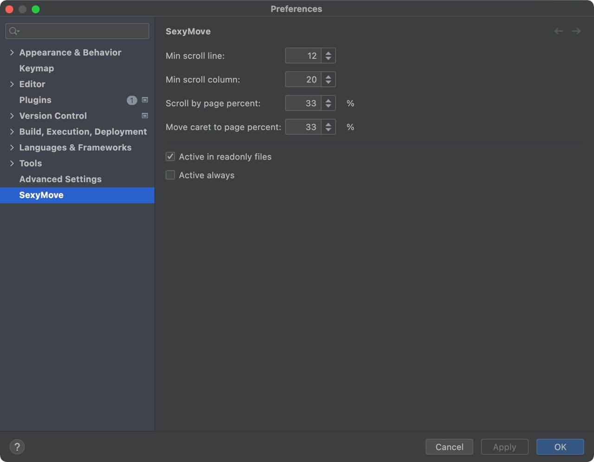

# SexyMove

> Vim is great! But too much for the IDE.

<!-- Plugin description -->
Toggle SexyMove mode to scroll and move your editor in a sexy way (like `Vim` but much simpler).

- <kbd>Ctrl</kbd>+<kbd>'</kbd>(<kbd>⌘</kbd>+<kbd>'</kbd> on mac): Enter SexyMove mode
- <kbd>Escape</kbd> or <kbd>i</kbd>: Exit SexyMove mode
- <kbd>h</kbd>/<kbd>j</kbd>/<kbd>k</kbd>/<kbd>l</kbd>: Scroll left/down/up/right
- <kbd>u</kbd>/<kbd>d</kbd>: Scroll page up/down
- <kbd>b</kbd>/<kbd>e</kbd>: Move the caret to previous/next word
- <kbd>[</kbd>/<kbd>]</kbd>: Navigate to previous/next location
- <kbd>a</kbd>/<kbd>s</kbd>: Switch to left/right tab
- <kbd>z</kbd>: Scroll to the caret
- <kbd>/</kbd>: Find in current file
- <kbd>Enter</kbd>: Move the caret to center
<!-- Plugin description end -->

video preview:

https://user-images.githubusercontent.com/22366182/152981434-90b47d65-6432-4d10-8d5f-fa4e0e2ece55.mp4

## Installation

- Using the IDE built-in plugin system:

  <kbd>Settings/Preferences</kbd> > <kbd>Plugins</kbd> > <kbd>Marketplace</kbd> > <kbd>Search for "SexyMove"</kbd> >
  <kbd>Install</kbd>

- Using JetBrains Marketplace:

  Go to [JetBrains Marketplace](https://plugins.jetbrains.com/plugin/MARKETPLACE_ID) and install it by clicking the <kbd>Install to ...</kbd> button in case your IDE is running.

  You can also download the [latest release](https://plugins.jetbrains.com/plugin/MARKETPLACE_ID/versions) from JetBrains Marketplace and install it manually using
  <kbd>Settings/Preferences</kbd> > <kbd>Plugins</kbd> > <kbd>⚙️</kbd> > <kbd>Install plugin from disk...</kbd>

- Manually:

  Download the [latest release](https://github.com/huoguangjin/plugin-template/releases/latest) and install it manually using
  <kbd>Settings/Preferences</kbd> > <kbd>Plugins</kbd> > <kbd>⚙️</kbd> > <kbd>Install plugin from disk...</kbd>

## Settings

## Build & Run

- JDK 21 is required, set `JAVA_HOME` environment variable, or set **Build, Execution, Deployment | Build Tools | Gradle | Gradle JVM** in IDEA settings.
  > [Build Number Ranges | IntelliJ Platform Plugin SDK](https://plugins.jetbrains.com/docs/intellij/build-number-ranges.html#platformVersions)

- How to run: `./gradlew runIde`. (see [predefined run/debug configurations](https://github.com/JetBrains/intellij-platform-plugin-template#predefined-rundebug-configurations) also)

- How to build: `./gradlew buildPlugin`.

## FAQ

- Why is it called "SexyMove"?

  Sexy Move is a [Rubik's Cube term](https://www.speedsolving.com/wiki/index.php/Sexy_Move) coined by Arnaud van Galen.
  It is one of the fastest move that you can perform on a cube.
  ([The origin of Sexy Move](https://youtu.be/EEt3NoW-lhs))
  > "...why do they call it the Sexy Move because it's really easy to perform, and it can be extremely fast!"

